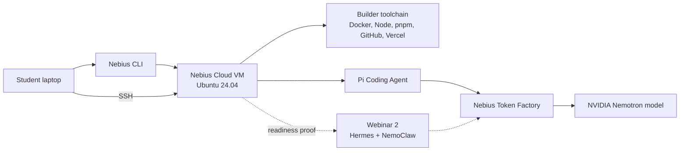

# Webinar 1: Nebius Cloud Builder Environment

Webinar 1 sets up the remote builder environment for the FDE Trainer series.

The participant provisions a Nebius Cloud VM, connects by SSH, installs the
baseline builder toolchain, configures Pi Coding Agent to use Nebius Token
Factory, and prepares the server for the Hermes/NemoClaw work in Webinar 2.

## Review Snapshot

Status: ready for Nebius DevRel review.

Prepared artifacts:

- [written-guide.md](written-guide.md) - student-facing guide with commands.
- [video-tutorial-script.md](video-tutorial-script.md) - 15-20 minute recording
  script with timing, diagram, screen cues, narration, and edit notes.
- [local-testing-research/](local-testing-research/) - supporting validation
  history from local and cloud experimentation.

Live dry-run status:

- Nebius Cloud VM provisioning was verified on July 5, 2026.
- The dry run used a CPU VM: `cpu-e2` / `4vcpu-16gb`.
- SSH access, Docker, Git, Node 22, npm 10, pnpm, jq, and `binutils` were
  verified on the VM.
- Nebius Token Factory direct inference worked with
  `nvidia/NVIDIA-Nemotron-3-Nano-30B-A3B`.
- Optional Hermes/NemoClaw validation worked on the same VM, including terminal
  chat through Hermes.
- The VM was deleted after the run; instance and disk lists returned empty.

Still not re-run on the deleted Nebius VM:

- Pi Coding Agent install/config.
- GitHub CLI auth.
- Vercel CLI auth.

Those steps are documented and supported by official docs, but a fresh VM pass
would be useful before final recording.

## Learning Outcome

By the end of Webinar 1, the participant should understand:

- How Nebius Cloud acts as the remote builder server.
- How Nebius Token Factory provides the model endpoint.
- Why the Webinar 1 VM does not need a GPU.
- How cloud-init makes the server repeatable.
- Why Pi Coding Agent should run inside the same environment it is helping to
  debug.
- How GitHub and Vercel fit into the first builder workflow.
- Why cleanup is part of responsible cloud usage.

## Architecture

## Recording Plan

The video script targets an edited 15-20 minute tutorial.

The rough pacing is:

| Time | Segment | What Happens |
| --- | --- | --- |
| 0:00-1:00 | Open | Explain the outcome and where Webinar 1 stops. |
| 1:00-3:00 | Architecture | Explain Nebius Cloud, Token Factory, Pi, and Hermes/NemoClaw boundaries. |
| 3:00-4:30 | Docs/dashboard | Show official docs and Nebius console orientation. |
| 4:30-6:00 | CLI profile | Install/configure Nebius CLI with federation auth. |
| 6:00-8:30 | VM setup | Choose CPU VM shape and explain cloud-init. |
| 8:30-10:30 | Provision + SSH | Create the VM, find public IP, connect. |
| 10:30-12:00 | Baseline check | Verify Docker, Node, pnpm, jq, and related tools. |
| 12:00-14:30 | Token Factory | Load API key, choose Nemotron model, run smoke test. |
| 14:30-16:30 | Pi Coding Agent | Install Pi and explain Token Factory config. |
| 16:30-17:30 | GitHub + Vercel | Install first collaboration/deploy CLIs. |
| 17:30-19:00 | Optional Hermes proof | Show readiness only; full Hermes tutorial is Webinar 2. |
| 19:00-20:00 | Cleanup | Delete VM and verify no instance/disk remains. |

A raw unedited recording of every install will exceed 20 minutes. Long waits
should be cut or speed-ramped.

## Product Moments To Make Clear

Nebius Cloud:

- The VM is the shared builder environment for the series.
- It is disposable because cloud-init scripts the baseline setup.
- The first VM shape is CPU-only because inference is external.

Nebius Token Factory:

- Token Factory is the LLM endpoint used by Pi and the optional Hermes bridge.
- It is OpenAI-compatible, so tools can point to it with a base URL, model, and
  API key.
- The dry run used an NVIDIA Nemotron model.

Pi Coding Agent:

- Pi is the setup/debugging assistant for the server.
- It should run inside the server so its observations match the real
  environment.

Hermes/NemoClaw:

- Webinar 1 only proves readiness.
- Webinar 2 teaches the full Hermes/NemoClaw installation and workflow.

## Files

| File | Use It For |
| --- | --- |
| [written-guide.md](written-guide.md) | Participant steps, commands, verification, cleanup. |
| [video-tutorial-script.md](video-tutorial-script.md) | Recording flow, narration, timing, screen cues. |
| [local-testing-research/README.md](local-testing-research/README.md) | Context on prior local validation. |

## Reviewer Questions

- Is `cpu-e2` / `4vcpu-16gb` the right default recommendation for this opener?
- Should the guide prefer a different Nebius image, CLI workflow, or console
  path for webinar participants?
- Is the Token Factory explanation accurate and clear for builders seeing it
  for the first time?
- Should the optional Hermes/NemoClaw readiness proof stay in Webinar 1, or be
  removed to keep the opener tighter?
- Are there Nebius DevRel calls to action, credit-code steps, or docs links
  that should be added before recording?

## Boundary

Webinar 1 ends when the builder server is ready.

The final artifact is not yet the FDE Trainer Agent. That starts after Webinar
2, once Hermes/NemoClaw is installed and available as the agent harness.
