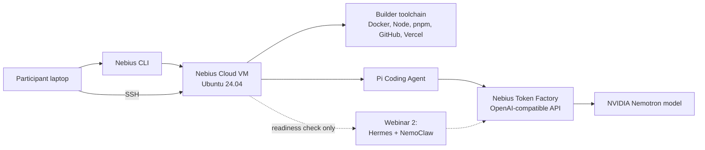

# Video Tutorial Script: Webinar 1 - Nebius Cloud Builder Server

## Recording Target

Target edited runtime: 15-20 minutes.

Ideal runtime: about 18 minutes, excluding waits for VM creation, package
installation, and optional Hermes/NemoClaw installation.

This should feel like a guided build, not a command-reading session. Use the
companion [written guide](written-guide.md) for exact command blocks. The video
should explain what each layer is for, show where the official docs live, and
make the architecture clear enough that participants understand why they are
running each command.

## Participant Outcome

By the end of the video, the participant has:

- A Nebius Cloud VM created from their laptop.
- SSH access into the VM.
- A baseline builder toolchain on the VM: Docker, Git, Node, npm, pnpm, jq,
  curl, unzip, wget, and binutils.
- A Nebius Token Factory API key loaded for the current shell.
- Pi Coding Agent installed and ready to be configured against Token Factory.
- GitHub CLI and Vercel CLI installed as the first builder workflow tools.
- A clear understanding that Hermes/NemoClaw starts in Webinar 2.

## Recording Rule

Do not show API keys. Do not paste secrets into chat. Do not leave a billable VM
running after the recording.

When a command takes longer than 20-30 seconds, pause recording or speed-ramp
the section in editing.

## Timeline

| Time | Segment | Main Screen | Teaching Goal |
| --- | --- | --- | --- |
| 0:00-1:00 | Open | Written guide | What we are building and where Webinar 1 stops. |
| 1:00-3:00 | Architecture | Diagram | Nebius Cloud vs Token Factory vs Pi vs Hermes. |
| 3:00-4:30 | Docs/dashboard orientation | Browser | Where official docs and Nebius console fit. |
| 4:30-6:00 | Nebius CLI profile | Terminal + docs | Local CLI controls cloud resources. |
| 6:00-8:30 | VM shape and cloud-init | Terminal + guide | Why this VM shape and what first boot installs. |
| 8:30-10:30 | Create VM and SSH | Terminal + Nebius console | Provision the server and connect to it. |
| 10:30-12:00 | Verify server baseline | SSH terminal | Confirm the machine is usable. |
| 12:00-14:30 | Token Factory | Token Factory docs + terminal | Inference is external, not local GPU. |
| 14:30-16:30 | Pi Coding Agent | Pi docs + SSH terminal | Pi becomes the support/debugging assistant. |
| 16:30-17:30 | GitHub + Vercel | CLI docs + SSH terminal | First collaboration/deploy tools. |
| 17:30-19:00 | Optional Hermes readiness | Terminal | Prove readiness without teaching Webinar 2. |
| 19:00-20:00 | Cleanup and recap | Terminal + guide | Delete resources and preview next webinar. |

If the recording is running long, skip the optional Hermes readiness segment and
show only the validated dry-run result from the guide.

## Architecture Diagram

Show this early, then return to it at the end.



Narration:

"The laptop is our control plane. Nebius Cloud is where the builder server
lives. Token Factory is where the model runs. Pi is our coding/debugging
assistant inside the server. Hermes and NemoClaw are intentionally not the main
lesson today; we only prove that the server is ready for them."

## Pre-Recording Checklist

Open these tabs before recording:

- Written guide: `01-nebius-cloud-builder-environment/written-guide.md`
- Nebius CLI install docs: https://docs.nebius.com/cli/install
- Nebius CLI quickstart: https://docs.nebius.com/cli/quickstart
- Nebius VM management docs: https://docs.nebius.com/compute/virtual-machines/manage
- Nebius VM platforms docs: https://docs.nebius.com/compute/virtual-machines/list-platforms
- Token Factory quickstart: https://docs.tokenfactory.nebius.com/quickstart
- Pi docs: https://pi.dev/docs/latest
- GitHub CLI Linux install docs: https://github.com/cli/cli/blob/trunk/docs/install_linux.md
- Vercel CLI docs: https://vercel.com/docs/cli
- Nebius console for the project, preferably on the compute/instances view.

Terminal prep:

- Local terminal on the laptop.
- SSH terminal once the VM exists.
- Keep any API key prompts off-screen or masked.

## Segment 1: Open

Target time: 0:00-1:00

Screen:

- Start on the written guide title and goals.

Narration:

"This is Webinar 1 of the FDE Trainer build series. Today we are not building
the agent yet. We are building the remote environment that lets us build the
agent reliably. By the end, we will have a Nebius Cloud server, Pi Coding Agent
configured for Token Factory, and the first workflow tools we will use across
the series."

"The reason we start here is simple: Forward Deployed Engineering work happens
in messy real environments. Before we can teach the agent to help us train for
that work, we need a clean server that can run the tools, receive changes, and
be deleted when we are done."

Learning beat:

- Webinar 1 = environment.
- Webinar 2 = Hermes/NemoClaw.
- Webinar 3 = skills and integrations.
- Webinar 4 = payments and runtime/workers.

## Segment 2: Architecture and Learning Frame

Target time: 1:00-3:00

Screen:

- Show the architecture diagram.

Narration:

"There are four layers to keep separate."

"Nebius Cloud is the machine. That is where our tooling runs. Token Factory is
the inference endpoint. That is where model calls go. Pi is the coding agent
inside the server that helps us debug and change files. Hermes and NemoClaw are
the agent harness and sandbox layer we start teaching in Webinar 2."

"This separation matters. We do not need a GPU on this Webinar 1 VM because the
model runs through Token Factory. That lets us use a normal CPU server with
enough memory for Docker, Node, Pi, and the later Hermes setup."

Learning beat:

- Cloud server != model server.
- CLI/auth creates and controls infrastructure.
- SSH moves us from laptop into the builder environment.
- Token Factory gives OpenAI-compatible inference.

## Segment 3: Docs and Dashboard Orientation

Target time: 3:00-4:30

Screen:

- Browser with Nebius CLI docs.
- Nebius console project view.
- Token Factory docs.
- Pi docs.

Narration:

"For the written guide, every install command points back to official docs. In
the video, I will show where the docs are, but the guide is the source of truth
for the copy-paste commands."

"In Nebius, the important resources for today are the project, the VM instance,
the subnet, and the boot disk. We will create the VM from the CLI, then confirm
it in the console. At the end, we will delete it and verify there are no
instances or disks left."

Screen action:

- Briefly show the CLI install docs.
- Briefly show the VM management docs.
- Briefly show Token Factory quickstart.
- Briefly show Pi docs.

Do not spend more than 90 seconds here. The goal is orientation, not reading
docs on camera.

## Segment 4: Install and Configure Nebius CLI

Target time: 4:30-6:00

Screen:

- Local terminal.
- Nebius CLI docs in browser if needed.

Run locally:

```bash
curl -sSL https://storage.eu-north1.nebius.cloud/cli/install.sh | bash
exec -l "$SHELL"
nebius version
```

Configure the profile:

```bash
export NEBIUS_PROJECT_ID="<your-nebius-project-id>"
nebius profile create --parent-id "$NEBIUS_PROJECT_ID"
nebius profile list
```

Prompt values:

- Profile name: `fde-webinar`
- API endpoint: `api.nebius.cloud`
- Authorization type: `federation`
- Federation endpoint: `auth.nebius.com`

Narration:

"I am using federation because this is an interactive workshop. It gives us a
browser-based human login. A service account key is the right tool for
automation later, but for a build-along webinar it adds secret-management work
that distracts from the goal."

Learning beat:

- Local CLI commands create cloud resources.
- Federation is appropriate for human-driven setup.
- Service keys are for automation, CI, and repeatable machine access.

## Segment 5: VM Shape and Cloud-Init

Target time: 6:00-8:30

Screen:

- Written guide, VM shape section.
- Local terminal.

Run locally:

```bash
nebius compute platform list --parent-id "$NEBIUS_PROJECT_ID"
```

Use the CPU shape:

```bash
export NEBIUS_VM_NAME="fde-builder-01"
export NEBIUS_VM_USER="fde"
export NEBIUS_PLATFORM="cpu-e2"
export NEBIUS_PRESET="4vcpu-16gb"
```

Fallback:

```bash
export NEBIUS_PLATFORM="cpu-d3"
export NEBIUS_PRESET="4vcpu-16gb"
```

Narration:

"We are choosing a 4 vCPU, 16 GB RAM CPU VM. That gives us enough room for the
developer tooling and the later containerized Hermes path. The LLM call still
goes to Token Factory, so we are not choosing a GPU instance for this first
webinar."

Screen action:

- Show the cloud-init block in the written guide.
- Do not read every line.
- Explain the categories:
  - user and SSH key
  - base packages
  - Docker
  - Node 22
  - pnpm
  - binutils for NemoClaw readiness

Narration:

"Cloud-init is first boot automation. Instead of SSHing into an empty server
and manually installing everything, we give Nebius a small setup file. When the
machine boots, it creates the `fde` user, installs the base tooling, enables
Docker, installs Node 22, and installs pnpm."

"We still use npm for global CLI installs when the tool's docs expect it. For
project dependencies, our default is pnpm."

Learning beat:

- Cloud-init makes the VM repeatable.
- The VM is disposable because setup is scripted.
- `binutils` is included because the live dry run showed NemoClaw needs the
  `strings` command.

## Segment 6: Create the VM and SSH

Target time: 8:30-10:30

Screen:

- Local terminal.
- Nebius console compute/instances page after creation.

Run locally:

```bash
export NEBIUS_SUBNET_ID="$(
  nebius vpc subnet list --format json | jq -r '.items[0].metadata.id'
)"
```

Then run the full `nebius compute instance create` command from the written
guide.

Narration:

"The subnet decides where the VM attaches to the network. We are using the
default subnet for the project. The instance command creates the VM, attaches a
public IP, and creates a managed 50 GiB boot disk."

"Managed boot disk matters for cleanup. When we delete the instance, Nebius can
also remove the managed disk attached through the instance spec."

Cut note:

- If VM creation takes more than 20-30 seconds, pause or speed-ramp.
- Resume when the instance ID appears.

After creation:

```bash
nebius compute instance get "$NEBIUS_INSTANCE_ID" --format json \
  > /tmp/nebius-fde-instance.json

export NEBIUS_VM_IP="$(
  jq -r '.. | objects | .public_ip_address? // empty | .address? // empty' \
    /tmp/nebius-fde-instance.json | head -n 1
)"
export NEBIUS_VM_IP="${NEBIUS_VM_IP%/*}"

ssh "${NEBIUS_VM_USER}@${NEBIUS_VM_IP}"
```

Narration:

"Nebius may return the public IP as CIDR, for example `x.x.x.x/32`. SSH needs
the plain address, so the guide strips the `/32` suffix before connecting."

Learning beat:

- Instance ID identifies the cloud resource.
- Public IP identifies how SSH reaches it.
- The laptop terminal changes from local control plane to remote server shell.

## Segment 7: Verify the Server Baseline

Target time: 10:30-12:00

Screen:

- SSH terminal inside the Nebius VM.

Run inside the server:

```bash
whoami
uname -a
git --version
docker --version
node --version
npm --version
pnpm --version
jq --version
node -e 'const [M,m]=process.versions.node.split(".").map(Number); process.exit(M>22 || (M===22 && m>=16) ? 0 : 1)' && echo "Node version OK"
npm -v | awk -F. '{ exit ($1 >= 10 ? 0 : 1) }' && echo "npm version OK"
```

Narration:

"This is the first checkpoint. Before installing agents or wiring models, we
verify the server is what we think it is. This helps us catch cloud-init
failures immediately."

Dry-run facts to mention briefly:

- Docker worked.
- Node 22 worked.
- npm 10 worked.
- pnpm worked.
- jq worked.

Learning beat:

- Verify the foundation before debugging higher layers.
- This is the habit we want the FDE Trainer Agent to teach later: inspect the
  environment before assuming the bug is in the app.

## Segment 8: Token Factory and Model Smoke Test

Target time: 12:00-14:30

Screen:

- Token Factory docs.
- SSH terminal.

Narration:

"Token Factory is the model endpoint. It exposes an OpenAI-compatible API, which
means tools that can speak OpenAI-style chat completions can usually point to
Token Factory by changing the base URL, model, and API key."

Run inside the server:

```bash
read -r -s -p "Paste Nebius Token Factory API key, then press Enter: " NEBIUS_API_KEY
printf "\n"
export NEBIUS_API_KEY

if [ -n "$NEBIUS_API_KEY" ]; then
  echo "OK: NEBIUS_API_KEY is loaded for this shell"
else
  echo "FAIL: NEBIUS_API_KEY is empty"
fi

export NEBIUS_TF_MODEL="nvidia/NVIDIA-Nemotron-3-Nano-30B-A3B"
```

Optional model list:

```bash
curl -sS \
  -H "Authorization: Bearer $NEBIUS_API_KEY" \
  "https://api.tokenfactory.nebius.com/v1/models?verbose=true" \
  | jq -r '.data[] | select(.id | test("nvidia|nemotron"; "i")) | .id'
```

Smoke test:

```bash
HTTP_CODE=$(curl -sS -o /tmp/tokenfactory-direct.json -w '%{http_code}' \
  https://api.tokenfactory.nebius.com/v1/chat/completions \
  -H "Authorization: Bearer $NEBIUS_API_KEY" \
  -H "Content-Type: application/json" \
  -d "{\"model\":\"$NEBIUS_TF_MODEL\",\"messages\":[{\"role\":\"user\",\"content\":\"Reply exactly: token-factory-ready\"}],\"max_tokens\":512,\"temperature\":0}")

printf 'http=%s\n' "$HTTP_CODE"
jq -r '.choices[0] | "finish=\(.finish_reason) content=\(.message.content // "<null>") reasoning_chars=\((.message.reasoning // "") | length)"' /tmp/tokenfactory-direct.json
```

Narration:

"We use 512 max tokens for this smoke test because reasoning models may spend
some tokens internally before producing final content. In the dry run, a
20-token budget returned reasoning but no visible content. With the larger
budget, the model returned the expected `token-factory-ready` response."

Learning beat:

- API key lives only in the current shell for this tutorial.
- Model selection is a runtime choice.
- Smoke tests should inspect HTTP status and response body, not just assume a
  command succeeded.

## Segment 9: Pi Coding Agent

Target time: 14:30-16:30

Screen:

- Pi docs.
- SSH terminal.
- Written guide Pi config section.

Run inside the server:

```bash
sudo npm install -g --ignore-scripts @earendil-works/pi-coding-agent
hash -r
pi --version
mkdir -p "$HOME/.pi/agent"
```

Narration:

"Pi is the coding assistant we will use inside the server. The point is not to
run a coding agent on your laptop and hope it matches the cloud environment.
The point is to put the assistant in the same server where the rest of the
build happens."

"Because this is a disposable Nebius Cloud VM, we install VM-level CLI tools
with `sudo npm install -g`. We still keep pnpm for project dependencies. Do not
run `sudo apt install pi`; that is a different Ubuntu package, not the Pi Coding
Agent."

"For model configuration, we point Pi at Token Factory through an
OpenAI-compatible provider. The API key should come from the environment, not a
hard-coded config file committed to a repo."

Screen action:

- Show the `models.json` and `settings.json` templates in the written guide.
- Explain the fields:
  - provider/base URL
  - model name
  - environment variable for the key
  - default model scope

Run a minimal Pi verification if time allows:

```bash
pi --no-tools --no-context-files --no-session -p "Reply exactly: pi-ready"
```

Cut note:

- If Pi model behavior is inconsistent, do not debug deeply in the video.
  Explain that the written guide includes the expected config and that the goal
  of Webinar 1 is environment readiness.

Learning beat:

- Pi is support/debugging infrastructure.
- Keeping it inside the VM makes its fixes relevant to the deployed build
  environment.

## Segment 10: GitHub and Vercel

Target time: 16:30-17:30

Screen:

- GitHub CLI docs.
- Vercel CLI docs.
- SSH terminal.

Narration:

"GitHub and Vercel are our first workflow tools. GitHub is for source control
and collaboration. Vercel is our first app deployment path. We are not locking
the entire series to only these tools; we start with them because most builders
already understand the workflow."

Install GitHub CLI using the official command from the written guide.

Install Vercel CLI:

```bash
sudo npm install -g vercel
hash -r
vercel --version
```

Narration:

"Again, npm is acceptable here because Vercel CLI is a global CLI install.
Inside actual projects, we prefer pnpm."

If time allows, show auth commands without completing them on camera:

```bash
gh auth login
vercel login
```

Learning beat:

- Tooling setup is part of the builder environment.
- Auth flows are personal, so keep secrets and browser tokens off-screen.

## Segment 11: Optional Hermes Readiness Check

Target time: 17:30-19:00

Use this segment only if the recording still has time. Otherwise, skip it and
say it is fully covered in Webinar 2.

Screen:

- SSH terminal.
- Written guide optional Hermes section.

Narration:

"This is not the Hermes lesson. This is a readiness check. We are proving that
the server shape, Docker setup, Token Factory endpoint, and model selection are
compatible with the next webinar."

Run quick prechecks:

```bash
docker ps
command -v strings
test -n "$NEBIUS_API_KEY" && echo "NEBIUS_API_KEY is loaded"
```

Show the install command in the guide, but do not spend raw time waiting for
the full install in a 15-20 minute video.

Call out the important settings:

- `NEMOCLAW_AGENT=hermes`
- `NEMOCLAW_PROVIDER=custom`
- `NEMOCLAW_ENDPOINT_URL=https://api.tokenfactory.nebius.com/v1/`
- `NEMOCLAW_MODEL="$NEBIUS_TF_MODEL"`
- `NEMOCLAW_REASONING=true`
- `NEMOCLAW_SANDBOX_NAME=fde-hermes-nebius`

Narration:

"The important part is that NemoClaw is using Token Factory as an
OpenAI-compatible endpoint. We also pass reasoning support because this
Nemotron model can return reasoning fields."

If showing post-install validation:

```bash
source "$HOME/.bashrc"
export PATH="$HOME/.local/bin:$PATH"
nemohermes fde-hermes-nebius status
nemohermes fde-hermes-nebius connect
```

Dry-run facts:

- Hermes/NemoClaw install completed.
- Direct Token Factory test returned `token-factory-ready`.
- Hermes gateway test returned `hermes-ready`.
- Terminal chat worked.

Learning beat:

- Webinar 1 proves the environment can support Webinar 2.
- The full Hermes tutorial belongs in Webinar 2, using the existing
  `fruteroclub/nebius-nemoclaw-tutorial` path.

## Segment 12: Cleanup and Recap

Target time: 19:00-20:00

Screen:

- Local terminal.
- Nebius console after deletion.

Narration:

"Last step: delete the machine. This is a webinar environment, not a permanent
production server. Cleanup is part of the tutorial because cloud resources cost
money."

Run locally:

```bash
nebius compute instance delete "$NEBIUS_INSTANCE_ID"
```

Verify:

```bash
nebius compute instance list --parent-id "$NEBIUS_PROJECT_ID" --format json \
  | jq -r '.items[]? | [.metadata.id, .metadata.name, (.status.state // "unknown")] | @tsv'

nebius compute disk list --parent-id "$NEBIUS_PROJECT_ID" --format json \
  | jq -r '.items[]? | [.metadata.id, .metadata.name, (.status.state // "unknown")] | @tsv'
```

Narration:

"In the dry run, both lists returned empty after deletion. That is the state we
want before ending the recording."

Recap:

"We now have the repeatable path for creating the builder server: Nebius CLI,
VM provisioning, cloud-init, SSH, baseline verification, Token Factory, Pi,
GitHub, and Vercel. In Webinar 2, we use this environment to install and teach
Hermes with NemoClaw."

## Editing Notes

- Keep the final video under 20 minutes.
- Cut waiting time from:
  - Nebius CLI install if slow.
  - VM provisioning.
  - apt/package installation.
  - NemoClaw install, if shown.
- Keep architecture explanation visible early and briefly return to it at the
  end.
- Use zooms or callouts for:
  - `cpu-e2` / `4vcpu-16gb`
  - managed 50 GiB boot disk
  - `NEBIUS_API_KEY`
  - Token Factory base URL
  - selected Nemotron model
  - cleanup verification returning empty lists
- Mask all secrets.
- Do not show personal billing, tokens, or private project details longer than
  necessary.

## Readiness Verdict

The script is ready for a 15-20 minute edited tutorial if the optional
Hermes/NemoClaw segment is treated as a short readiness proof, not a full live
install. A raw unedited recording of all installs will exceed 20 minutes.
